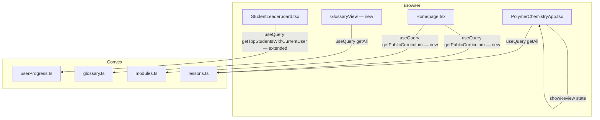

# Design Document: Student UX Improvements

## Overview

This document describes the technical design for five student-facing improvements to PolymerLingo:

1. **Review Screen answer breakdowns** — show student answer, correct answer, and explanation per question (Requirements 1–4)
2. **Leaderboard current-user row** — always surface the current user's rank and XP even when outside the top 10 (Requirement 5)
3. **Glossary view** — read-only, searchable glossary accessible from student navigation (Requirement 6)
4. **Homepage curriculum preview** — public section showing modules and lesson counts, scrolled to by "View Curriculum" (Requirement 7)

All changes are additive. No schema migrations are required for the review screen or glossary. The leaderboard requires extending one Convex query. The homepage requires one new public Convex query.

---

## Architecture

The app follows a client-server split:

- **Frontend**: React 19 client components inside `app/components/`, using Convex `useQuery` / `useMutation` hooks for real-time data.
- **Backend**: Convex serverless functions in `app/convex/`, with Clerk providing auth identity via `ctx.auth.getUserIdentity()`.



### Key architectural decisions

- **Review screen stays inside `PolymerChemistryApp.tsx`**: The review is a local state branch (`showReview === true`) within the existing state machine. Extracting it to a separate component would require threading many props; instead the review rendering block is refactored in-place, replacing the current minimal card with a richer `AnswerBreakdownCard` sub-component defined in the same file.
- **Glossary as a new state branch**: Rather than a separate route, the glossary is added as a new `showGlossary` boolean state inside `PolymerChemistryApp.tsx`, consistent with how `showSettings` and `showLeaderboard` are handled. This avoids routing complexity and keeps the student app self-contained.
- **Leaderboard query extended, not duplicated**: `getTopStudents` is replaced by `getTopStudentsWithCurrentUser`, which accepts the caller's identity and returns both the top-10 list and the current user's rank/XP in one response. The client passes no extra arguments — Convex resolves identity server-side.
- **Homepage public query**: `api.modules.getAll` and `api.lessons.getAll` both call `ctx.auth.getUserIdentity()` but do not throw if unauthenticated (modules.getAll has no auth check; lessons.getAll returns a filtered set). A new `getPublicCurriculum` query in `convex/modules.ts` returns modules with lesson counts without requiring auth, keeping the homepage fully public.

---

## Components and Interfaces

### 1. Review Screen — `PolymerChemistryApp.tsx` (modified)

The existing `showReview` branch is refactored. The per-question `div` is replaced by an `AnswerBreakdownCard` inline component.

**`AnswerBreakdownCard` props:**
```ts
interface AnswerBreakdownCardProps {
  index: number;           // 0-based question index
  question: any;           // lesson question object (mcq | fillblank | dragdrop)
  studentAnswer: any;      // selectedAnswers[index]
  isCorrect: boolean;      // pre-computed correctness
}
```

**Rendered structure per card (in order):**
1. Question number + question text
2. Correct/incorrect status icon (CheckCircle2 / XCircle)
3. Student answer section (red tint if wrong, green if correct)
4. Correct answer section (always green)
5. Explanation (omitted if empty/missing)

**Answer display by type:**

| Type | Student Answer | Correct Answer |
|------|---------------|----------------|
| `mcq` | `options[selectedAnswer]` or "No answer submitted" | `options[correct]` |
| `fillblank` | entered string or "No answer submitted" | `correctAnswer` string |
| `dragdrop` | list of `section.name: [answers]` pairs | list of `section.name: [answers]` pairs from `sections` |

### 2. Leaderboard — `StudentLeaderboard.tsx` (modified) + `userProgress.ts` (modified)

**New Convex query signature (`userProgress.ts`):**
```ts
// replaces getTopStudents
export const getTopStudentsWithCurrentUser = query({
  args: {},
  handler: async (ctx) => {
    // returns: { topStudents: TopStudent[], currentUser: CurrentUserRank | null }
  }
})

type TopStudent = { id: string; name: string; xp: number; isCurrentUser: boolean }
type CurrentUserRank = { rank: number; name: string; xp: number; inTopTen: boolean }
```

The query:
1. Fetches all `userProgress` records, sorts by XP descending.
2. Identifies the current user via `ctx.auth.getUserIdentity()` (returns `null` if unauthenticated).
3. Computes rank = count of users with strictly greater XP + 1.
4. Returns top 10 with an `isCurrentUser` flag on the matching entry (if present), plus a `currentUser` object with rank/xp/inTopTen.

**`StudentLeaderboard.tsx` changes:**
- Calls `getTopStudentsWithCurrentUser` instead of `getTopStudents`.
- If `currentUser.inTopTen === false`, renders a `<hr>` divider followed by a "you" row showing `Rank {n}`, name, and XP.
- If `currentUser.inTopTen === true`, highlights that row in the top-10 list (indigo ring or similar).
- If `currentUser === null` (unauthenticated), renders the top-10 list unchanged.

### 3. Glossary View — new state branch in `PolymerChemistryApp.tsx`

**State additions:**
```ts
const [showGlossary, setShowGlossary] = useState(false);
const glossaryTerms = useQuery(api.glossary.getAll); // only fetched when needed
```

**`GlossaryView` inline component (or small extracted component):**
- Renders when `showGlossary === true`.
- Fetches `api.glossary.getAll` (already sorted alphabetically by `by_term` index).
- Local `searchQuery` state filters terms client-side (case-insensitive `term.includes(query)`).
- Shows loading spinner while `glossaryTerms === undefined`.
- Shows "No terms found" when filtered list is empty.
- Back button sets `showGlossary(false)`.

**Navigation addition:**
- Mobile bottom bar: add a `Book` icon button for "Glossary" alongside Home and Settings.
- Desktop: add a Glossary button in the dashboard header area (consistent with the Settings gear).

### 4. Homepage Curriculum Preview — `Homepage.tsx` (modified) + `modules.ts` (new query)

**New Convex query (`convex/modules.ts`):**
```ts
export const getPublicCurriculum = query({
  args: {},
  handler: async (ctx) => {
    // No auth check — public
    const modules = await ctx.db.query("modules").collect()
    const lessons = await ctx.db.query("lessons").collect()
    return modules
      .sort((a, b) => a.order - b.order)
      .map(m => ({
        ...m,
        lessonCount: lessons.filter(l => l.section === m.moduleKey).length
      }))
  }
})
```

**`Homepage.tsx` changes:**
- Add `useQuery(api.modules.getPublicCurriculum)` — this requires converting `Homepage.tsx` to a client component (`"use client"`).
- Add a `curriculumRef = useRef<HTMLDivElement>(null)` and wire the "View Curriculum" button to `curriculumRef.current?.scrollIntoView({ behavior: 'smooth' })`.
- Add a `<section id="curriculum" ref={curriculumRef}>` below the hero, rendering a grid of module cards.
- Each module card shows: code, title, description, lesson count badge.
- Loading state: skeleton placeholder cards.
- Empty state: "Curriculum content coming soon" message.

---

## Data Models

No schema changes are required. All existing tables support the new features as-is.

### Relevant existing shapes

**`lessons` question union** (from `schema.ts`):
```ts
// MCQ
{ type?: "mcq" | string, question, options: string[], correct: number, explanation, imageUrl?, imageStorageId? }
// Fill-in-the-blank
{ type: "fillblank", question, correctAnswer: string, explanation, imageUrl?, imageStorageId? }
// Drag-and-drop
{ type: "dragdrop", question, answerBank: string[], sections: { name, answers: string[] }[], explanation, imageUrl?, imageStorageId? }
```

**`userProgress`** (from `schema.ts`):
```ts
{ userId, userName?, xp, streak, lastLoginDate?, completedLessonIds, lastUpdated? }
```

**`glossary`** (from `schema.ts`):
```ts
{ term: string, definition: string }
// index: by_term (ascending) — already sorted correctly
```

**`modules`** (from `schema.ts`):
```ts
{ moduleKey, code, title, description, color, iconKey, order, isDefault }
```

### Query response shapes (new/extended)

**`getTopStudentsWithCurrentUser` response:**
```ts
{
  topStudents: Array<{ id: string; name: string; xp: number; isCurrentUser: boolean }>;
  currentUser: { rank: number; name: string; xp: number; inTopTen: boolean } | null;
}
```

**`getPublicCurriculum` response:**
```ts
Array<{
  _id: Id<"modules">;
  moduleKey: string;
  code: string;
  title: string;
  description: string;
  color: string;
  iconKey: string;
  order: number;
  isDefault: boolean;
  lessonCount: number;
}>
```

---

## Correctness Properties

*A property is a characteristic or behavior that should hold true across all valid executions of a system — essentially, a formal statement about what the system should do. Properties serve as the bridge between human-readable specifications and machine-verifiable correctness guarantees.*

### Property 1: Answer breakdown card count equals question count

*For any* lesson with N questions, rendering the Review Screen should produce exactly N Answer_Breakdown cards — one per question, in the same order.

**Validates: Requirements 4.1, 4.4**

---

### Property 2: Every card contains all required elements

*For any* lesson question (regardless of type), the rendered Answer_Breakdown card should contain: a question number, the question text, a correct/incorrect status indicator, a student answer section, a correct answer section, and (if the explanation is non-empty) an explanation section.

**Validates: Requirements 1.1, 1.2, 2.1–2.5, 3.1–3.5, 4.2**

---

### Property 3: Explanation omitted when empty

*For any* question whose `explanation` field is an empty string or absent, the rendered Answer_Breakdown card should not contain an explanation element.

**Validates: Requirements 1.3**

---

### Property 4: Leaderboard current-user rank is consistent with XP ordering

*For any* set of user progress records, the current user's rank returned by `getTopStudentsWithCurrentUser` should equal the count of users with strictly greater XP plus one.

**Validates: Requirements 5.4**

---

### Property 5: Current user row appears exactly once

*For any* leaderboard state, the current user's name and XP should appear exactly once — either highlighted within the top-10 list (if in top 10) or as a separate row below the divider (if not in top 10), never both.

**Validates: Requirements 5.1, 5.3**

---

### Property 6: Glossary search filters correctly

*For any* list of glossary terms and any search string, the filtered result should contain exactly those terms whose `term` field contains the search string (case-insensitive), and no others.

**Validates: Requirements 6.5, 6.6, 6.7**

---

### Property 7: Curriculum preview module order matches `order` field

*For any* set of modules returned by `getPublicCurriculum`, the modules should appear in ascending order of their `order` field.

**Validates: Requirements 7.5**

---

### Property 8: Curriculum preview lesson counts are accurate

*For any* set of modules and lessons, the `lessonCount` for each module in `getPublicCurriculum` should equal the number of lessons whose `section` field matches that module's `moduleKey`.

**Validates: Requirements 7.2**

---

## Error Handling

| Scenario | Handling |
|----------|----------|
| `glossaryTerms === undefined` (loading) | Show spinner; do not render term list |
| `glossaryTerms` is empty array | Show "No terms found" (same as empty search result) |
| `getPublicCurriculum` returns `undefined` | Show skeleton cards on homepage |
| `getPublicCurriculum` returns empty array | Show "Curriculum content coming soon" message |
| `getTopStudentsWithCurrentUser` — unauthenticated caller | `currentUser` field is `null`; render top-10 list without a "you" row |
| `getTopStudentsWithCurrentUser` — user has no progress record | Return `currentUser` with `xp: 0`, `rank: totalStudents + 1` |
| `selectedAnswers[idx]` is `null` on review screen | Display "No answer submitted" for that question |
| `dragdrop` student answer has missing sections | Treat missing sections as empty answer arrays |
| Question `explanation` is empty string or undefined | Omit explanation area from the card entirely |

---

## Testing Strategy

### Unit tests

Focus on pure logic functions that can be tested without a DOM or Convex runtime:

- `computeRank(allProgress, userId)` — given an array of progress records and a user ID, returns the correct rank integer.
- `filterGlossaryTerms(terms, query)` — given a term list and search string, returns the correctly filtered subset.
- `getCorrectAnswerDisplay(question)` — given a question of each type, returns the expected display string/structure.
- `getStudentAnswerDisplay(question, studentAnswer)` — given a question and student answer, returns the expected display string/structure.

### Property-based tests

Use **fast-check** (already compatible with the Vitest setup in `app/vitest.config.ts`). Each test runs a minimum of 100 iterations.

**Property test 1: Answer breakdown card count equals question count**
```
// Feature: student-ux-improvements, Property 1: card count equals question count
fc.property(fc.array(arbitraryQuestion(), { minLength: 1, maxLength: 20 }), (questions) => {
  const cards = renderAnswerBreakdowns(questions, mockAnswers(questions))
  return cards.length === questions.length
})
```

**Property test 2: Every card contains required elements**
```
// Feature: student-ux-improvements, Property 2: every card contains required elements
fc.property(arbitraryQuestion(), arbitraryStudentAnswer(), (question, answer) => {
  const card = renderAnswerBreakdownCard(question, answer)
  return hasQuestionText(card) && hasStatusIcon(card) && hasStudentAnswer(card) && hasCorrectAnswer(card)
})
```

**Property test 3: Explanation omitted when empty**
```
// Feature: student-ux-improvements, Property 3: explanation omitted when empty
fc.property(arbitraryQuestionWithEmptyExplanation(), (question) => {
  const card = renderAnswerBreakdownCard(question, null)
  return !hasExplanationElement(card)
})
```

**Property test 4: Leaderboard rank is consistent with XP ordering**
```
// Feature: student-ux-improvements, Property 4: rank consistent with XP ordering
fc.property(fc.array(arbitraryProgressRecord(), { minLength: 1 }), fc.string(), (records, userId) => {
  const rank = computeRank(records, userId)
  const expected = records.filter(r => r.xp > (records.find(r => r.userId === userId)?.xp ?? 0)).length + 1
  return rank === expected
})
```

**Property test 5: Current user appears exactly once**
```
// Feature: student-ux-improvements, Property 5: current user appears exactly once
fc.property(fc.array(arbitraryProgressRecord(), { minLength: 1 }), fc.integer({ min: 0 }), (records, currentIdx) => {
  const userId = records[currentIdx % records.length].userId
  const result = buildLeaderboardData(records, userId)
  const occurrences = countUserOccurrences(result, userId)
  return occurrences === 1
})
```

**Property test 6: Glossary search filters correctly**
```
// Feature: student-ux-improvements, Property 6: glossary search filters correctly
fc.property(fc.array(arbitraryGlossaryTerm()), fc.string(), (terms, query) => {
  const filtered = filterGlossaryTerms(terms, query)
  const expected = terms.filter(t => t.term.toLowerCase().includes(query.toLowerCase()))
  return filtered.length === expected.length && filtered.every(t => expected.some(e => e.term === t.term))
})
```

**Property test 7: Curriculum module order**
```
// Feature: student-ux-improvements, Property 7: curriculum module order
fc.property(fc.array(arbitraryModule(), { minLength: 1 }), (modules) => {
  const result = sortModulesByOrder(modules)
  return result.every((m, i) => i === 0 || result[i - 1].order <= m.order)
})
```

**Property test 8: Curriculum lesson counts**
```
// Feature: student-ux-improvements, Property 8: curriculum lesson counts accurate
fc.property(fc.array(arbitraryModule()), fc.array(arbitraryLesson()), (modules, lessons) => {
  const result = buildCurriculumData(modules, lessons)
  return result.every(m => m.lessonCount === lessons.filter(l => l.section === m.moduleKey).length)
})
```
