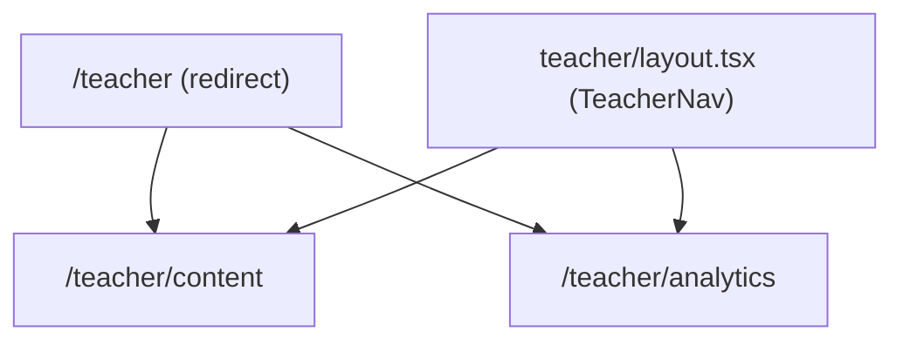

# Design Document: UX Improvements

## Overview

The PolymerLingo teacher dashboard is currently a single monolithic component (`Teacher.tsx`, ~3300 lines) rendered at `/teacher`. This design splits it into two focused sub-pages — `/teacher/content` and `/teacher/analytics` — connected by a persistent `TeacherNav`. It also replaces all browser-native `alert()`/`confirm()` dialogs with inline feedback, fixes page metadata, and introduces responsive layouts.

The refactor is primarily structural: the existing Convex queries and mutations remain unchanged. The work is decomposed into new route files, extracted components, and a shared navigation layer.

---

## Architecture

### Route Structure

```
/teacher                    → redirects to /teacher/content
/teacher/content            → Content_Manager page
/teacher/analytics          → Analytics_Dashboard page
```

All three routes share a layout that renders `TeacherNav`. The layout lives at `app/app/teacher/layout.tsx` and wraps every page under `/teacher`.



### Component Decomposition

The monolithic `Teacher.tsx` is split into focused components:

```
app/
├── app/teacher/
│   ├── layout.tsx              ← NEW: shared layout with TeacherNav
│   ├── page.tsx                ← UPDATED: redirect to /teacher/content
│   ├── content/
│   │   └── page.tsx            ← NEW: Content_Manager page
│   └── analytics/
│       └── page.tsx            ← NEW: Analytics_Dashboard page
│
└── components/teacher/
    ├── TeacherNav.tsx          ← NEW: persistent nav (sidebar/topbar)
    ├── ContentManager.tsx      ← NEW: extracted from Teacher.tsx
    ├── AnalyticsDashboard.tsx  ← NEW: extracted from Teacher.tsx
    ├── InlineToast.tsx         ← NEW: replaces alert()
    └── ConfirmDialog.tsx       ← NEW: replaces confirm()
```

The original `Teacher.tsx` is kept intact during the transition and can be deprecated once the split components are verified.

---

## Components and Interfaces

### TeacherNav

Persistent navigation rendered in `teacher/layout.tsx`. Receives no props — it reads the current pathname via `usePathname()` to highlight the active route.

```tsx
// Renders as sidebar on ≥1024px, top bar on <1024px
export function TeacherNav() { ... }
```

Nav items:
- "Content" → `/teacher/content`
- "Analytics" → `/teacher/analytics`
- "Back to App" → `/`

### ContentManager

Owns all state and logic currently in `Teacher.tsx` related to modules, lessons, questions, and glossary. Accepts no props — it fetches its own data via Convex hooks.

Key internal state groups (unchanged from current Teacher.tsx):
- Module form state (`newModuleCode`, `editingModuleId`, etc.)
- Lesson form state (`newLessonTitle`, `editingLessonId`, etc.)
- Question editor state (`questionType`, `questionText`, `ddSections`, etc.)
- Glossary state (`editingGlossaryId`, `newGlossaryTerm`, etc.)

Replaces all `alert()` / `confirm()` calls with:
- `useToast()` hook → renders `InlineToast` for success/error messages
- `ConfirmDialog` component → renders inline for destructive actions

### AnalyticsDashboard

Owns all state and logic currently in `Teacher.tsx` related to class stats, student leaderboard, and student reports. Accepts no props.

Key internal state:
- `searchQuery` — filters leaderboard
- `selectedStudentUserId` / `selectedStudentName` — drives Student_Report panel
- `studentReportAttemptFilter` — filters attempt history
- `expandedReportLessons` — tracks expanded lesson rows
- `selectedLessonId` — drives per-lesson aggregate view

### InlineToast

A lightweight notification component rendered at the bottom-right of the page. Supports `success`, `error`, and `info` variants. Auto-dismisses after 4 seconds.

```tsx
interface ToastMessage {
  id: string;
  variant: "success" | "error" | "info";
  message: string;
}

// Hook used by ContentManager
function useToast(): {
  toasts: ToastMessage[];
  toast: (variant: ToastMessage["variant"], message: string) => void;
  dismiss: (id: string) => void;
}
```

### ConfirmDialog

An inline popover/dialog that replaces `window.confirm()`. Renders adjacent to the triggering element (or as a centered modal on mobile).

```tsx
interface ConfirmDialogProps {
  open: boolean;
  title: string;
  description: string;
  onConfirm: () => void;
  onCancel: () => void;
  destructive?: boolean;
}
```

---

## Data Models

No changes to the Convex schema. All existing tables (`modules`, `lessons`, `lessonAttempts`, `userProgress`, `glossary`) remain as-is.

### Page Metadata

Each route exports a `metadata` object (Next.js App Router convention):

| Route | `<title>` |
|---|---|
| `app/app/layout.tsx` | `PolymerLingo` |
| `app/app/teacher/layout.tsx` | `PolymerLingo — Teacher Dashboard` |
| `app/app/teacher/content/page.tsx` | `Content Manager — PolymerLingo` |
| `app/app/teacher/analytics/page.tsx` | `Analytics — PolymerLingo` |

Since `content/page.tsx` and `analytics/page.tsx` are Server Components (metadata export only works in Server Components), the actual interactive content is rendered by `ContentManager` and `AnalyticsDashboard` client components imported within them.

### Responsive Breakpoints

| Breakpoint | TeacherNav | Content/Analytics layout |
|---|---|---|
| `< 768px` | Top bar | Single column (stacked) |
| `768px – 1023px` | Top bar | Single column |
| `≥ 1024px` | Sidebar (left) | Two-column split |

Tailwind classes used: `lg:flex-row`, `lg:w-64`, `lg:grid-cols-2`, `flex-col`.

---

## Correctness Properties

*A property is a characteristic or behavior that should hold true across all valid executions of a system — essentially, a formal statement about what the system should do. Properties serve as the bridge between human-readable specifications and machine-verifiable correctness guarantees.*

### Property 1: Active nav item reflects current route

*For any* pathname under `/teacher`, the TeacherNav item whose href matches that pathname should have the active visual style applied, and no other nav item should have that style.

**Validates: Requirements 1.2**

---

### Property 2: Save operations produce inline feedback, not browser dialogs

*For any* save action (create/update module, lesson, question, or glossary term), the operation should result in an `InlineToast` being added to the toast list, and `window.alert` should never be called.

**Validates: Requirements 2.7, 4.1**

---

### Property 3: Validation errors appear inline, not as browser dialogs

*For any* save attempt with a missing required field, the system should display an inline validation error adjacent to the relevant field, and `window.alert` should never be called.

**Validates: Requirements 2.8, 4.1**

---

### Property 4: Destructive actions require inline confirmation

*For any* delete action (module, lesson, question, glossary term, student removal), the action should not execute until an inline `ConfirmDialog` has been explicitly confirmed, and `window.confirm` should never be called.

**Validates: Requirements 4.2, 4.3**

---

### Property 5: Leaderboard is sorted by XP descending

*For any* list of students, the leaderboard rendered by `AnalyticsDashboard` should display students in descending order of XP, such that no student appears before another student with higher XP.

**Validates: Requirements 3.2**

---

### Property 6: Student leaderboard search filters by name

*For any* search query string and student list, the filtered leaderboard should contain only students whose `userName` includes the query (case-insensitive), and no student whose name does not match should appear.

**Validates: Requirements 3.3**

---

### Property 7: Student report shows only attempted lessons

*For any* selected student, the Student_Report should display exactly the set of lessons for which that student has at least one `lessonAttempt` record, and no lessons the student has not attempted.

**Validates: Requirements 3.4, 3.5**

---

## Error Handling

### Convex Mutation Failures

All `async` mutation calls in `ContentManager` and `AnalyticsDashboard` are wrapped in `try/catch`. On failure, `toast("error", e.message || "Operation failed.")` is called instead of `alert()`.

### Validation Errors

Required-field validation runs before any mutation is called. Errors are stored in a `fieldErrors` state map keyed by field name and rendered as `<p className="text-red-500 text-xs mt-1">` adjacent to the relevant input. The mutation is not called if any field error exists.

### Image Upload Failures

The existing `processAndUpload` error path calls `alert()` — this is replaced with `toast("error", ...)`.

### Navigation / Redirect

`/teacher` uses `redirect("/teacher/content")` from `next/navigation` in a Server Component, so no client-side error handling is needed there.

---

## Testing Strategy

### Unit Tests

Unit tests cover specific examples and edge cases:

- `TeacherNav` renders the correct active class for `/teacher/content` and `/teacher/analytics`
- `TeacherNav` renders the "Back to App" link pointing to `/`
- `InlineToast` auto-dismisses after 4 seconds
- `ConfirmDialog` calls `onConfirm` when confirmed and `onCancel` when cancelled
- Validation: saving a module with an empty title produces a field error and does not call the mutation
- Metadata: each page exports the correct `title` string

### Property-Based Tests

Property-based tests use **fast-check** (TypeScript-native, works with Vitest/Jest).

Each test runs a minimum of **100 iterations**.

Tag format: `Feature: ux-improvements, Property {N}: {property_text}`

**Property 1 — Active nav item reflects current route**
```
// Feature: ux-improvements, Property 1: active nav item reflects current route
// For any pathname under /teacher, exactly one nav item is active
fc.property(fc.constantFrom("/teacher/content", "/teacher/analytics"), (pathname) => {
  render(<TeacherNav />, { pathname });
  const activeItems = screen.getAllByRole("link", { current: "page" });
  return activeItems.length === 1 && activeItems[0].getAttribute("href") === pathname;
})
```

**Property 2 — Save operations produce inline feedback**
```
// Feature: ux-improvements, Property 2: save operations produce inline feedback
// For any valid module input, saving calls toast and never window.alert
fc.property(fc.record({ code: fc.string({ minLength: 1 }), title: fc.string({ minLength: 1 }), description: fc.string({ minLength: 1 }) }), async (input) => {
  const alertSpy = vi.spyOn(window, "alert");
  // trigger save with valid input, assert toast appears and alert not called
  expect(alertSpy).not.toHaveBeenCalled();
})
```

**Property 3 — Validation errors appear inline**
```
// Feature: ux-improvements, Property 3: validation errors appear inline
// For any save attempt with empty required fields, inline error shown, alert not called
fc.property(fc.constant({ code: "", title: "", description: "" }), async (input) => {
  const alertSpy = vi.spyOn(window, "alert");
  // trigger save with empty fields, assert field error element present
  expect(alertSpy).not.toHaveBeenCalled();
})
```

**Property 4 — Destructive actions require inline confirmation**
```
// Feature: ux-improvements, Property 4: destructive actions require inline confirmation
// For any delete trigger, confirm dialog appears before mutation fires
fc.property(fc.constantFrom("module", "lesson", "question", "glossary"), (entityType) => {
  const confirmSpy = vi.spyOn(window, "confirm");
  // trigger delete, assert ConfirmDialog rendered and mutation not yet called
  expect(confirmSpy).not.toHaveBeenCalled();
})
```

**Property 5 — Leaderboard is sorted by XP descending**
```
// Feature: ux-improvements, Property 5: leaderboard is sorted by XP descending
// For any student list, the rendered leaderboard order matches descending XP sort
fc.property(fc.array(fc.record({ userName: fc.string(), userId: fc.string(), xp: fc.integer({ min: 0 }) }), { minLength: 1 }), (students) => {
  const sorted = sortLeaderboard(students);
  for (let i = 0; i < sorted.length - 1; i++) {
    if (sorted[i].xp < sorted[i + 1].xp) return false;
  }
  return true;
})
```

**Property 6 — Student leaderboard search filters by name**
```
// Feature: ux-improvements, Property 6: student leaderboard search filters by name
// For any query and student list, filtered result contains only matching students
fc.property(fc.string(), fc.array(fc.record({ userName: fc.string(), userId: fc.string() })), (query, students) => {
  const result = filterStudents(students, query);
  return result.every(s => s.userName.toLowerCase().includes(query.toLowerCase()));
})
```

**Property 7 — Student report shows only attempted lessons**
```
// Feature: ux-improvements, Property 7: student report shows only attempted lessons
// For any student and attempt list, report contains exactly the attempted lessons
fc.property(fc.array(fc.record({ lessonId: fc.string(), userId: fc.string() })), (attempts) => {
  const lessonIds = new Set(attempts.map(a => a.lessonId));
  const report = buildStudentReport(attempts, allLessons);
  return report.every(row => lessonIds.has(String(row.lesson._id)));
})
```
